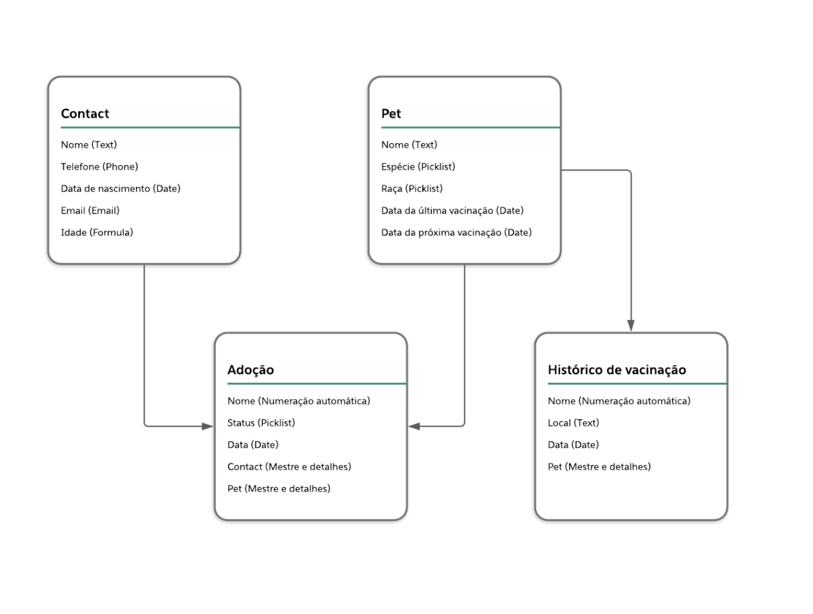

# Adoção de Pet

## Objetivo do desafio
Avaliar o desempenho técnico e o conhecimento da plataforma Salesforce.

## Solução
O objetivo da solução é criar um aplicativo no Salesforce para controlar e registrar as adoções de pets.

### Modelo de dados

### Solução técnica

#### Contact
1. Name (Campo padrão do Salesforce)
2. Telefone (Campo padrão do Salesforce)
3. Data de nascimento (Campo padrão do Salesforce)
4. E-mail (Campo padrão do Salesforce)
5. Idade (Fórmula que se baseia na data de nascimento com a data atual)

#### Pet
1. Name (Campo padrão do Salesforce)
2. Espécie (Campo de seleção de lista)
3. Raça (Campo de seleção de lista) 
4. Data da última vacinação (Campo de data)
5. Data da próxima vacinação (Campo de data)

#### Adoção
1. Name (Numeração automática gerado pelo próprio Salesforce)
2. Status (Campo de seleção de lista que representa a fase da adoção)
3. Data (Campo de data que representa a data da adoção)
4. Contact (Campo de relacionamento com o objeto Contact)
5. Pet (Campo de relacionamento com o objeto Pet)

#### Histórico de vacinação
1. Name (Numeração automática gerado pelo próprio Salesforce)
2. Local (Campo texto aberto que representa o local de vacinação)
3. Data (Campo de data que representa a data da vacinação)
4. Pet (Campo de relacionamento com o objeto Pet)

#### Regras de negócio
1. Todos os objetos criados deverão ter “Guias” para navegação.
2. Após os objetos e as guias criadas, um aplicativo com essas guias deverá ser criado.
3. A fórmula do campo “Idade” no objeto Contact deverá ser numérica e contabilizada sempre que o registro for acessado.
4. Os campos “Espécie” e “Raça” no objeto Pet deverão ser dependentes, ou seja, deverão ser exibidos apenas os valores de raças correspondentes de cada espécie.    Abaixo os valores:
    - Cachorro: Vira-lata e Poodle
    - Gato: Siamês e Persa
5. Uma adoção não pode ser criada com a data menor de hoje.
6. Se o contato da adoção for menor que 18 anos, a adoção não pode ser criada.
7. Por conta do fechamento contábil, a data da adoção não pode ser maior que o mês atual.
8. Não é permitido ter o mesmo contato cadastrado duas vezes com o mesmo e-mail.
9. Os valores de status da adoção deverão ser atualizados através de automação, ou seja, sem que ocorra alteração manual:
    - Aberto (Valor padrão)
    - Em aprovação (Quando um registro for enviado para a aprovação)
    - Aguardando busca do pet (Quando o registro é aprovado pelo processo de aprovação e está aguardando a busca do pet)
    - Finalizado (Quando a pessoa já buscou o pet e o processo de adoção finalizado)
    - Reprovada (Quando o registro é reprovado pelo processo de aprovação)
10. Criar um processo de aprovação simples para aprovação da adoção:
    - No momento da submissão, alterar o status para “Em aprovação”
    - No momento da submissão, enviar uma notificação por e-mail para o contato da adoção, informando que o processo está em andamento
    - Em caso de aprovação, alterar o status para “Aguardando busca do pet”
    - Em caso de reprovação, alterar o status para “Reprovada”
11. Após a finalização da aprovação, uma notificação por e-mail deverá ser disparada para o contato.
12. Se uma adoção for reprovada, ela não pode ser mais alterada.
13. Os layouts dos registros também serão avaliados, portanto, remova os campos não utilizados.
14. Os Lightning Pages também serão avaliados, é importante que distribua os componentes da tela de forma organizada.
15. Construir relatórios e painéis para análise dos KPI’s (Key Performance Indicator)

#### Desafios de desenvolvimento
#### Componente de exibição de informações na adoção

1. Criar componente LWC que deverá ser adicionado na tela da adoção e deverá exibir as seguintes informações:
    - Nome do contato
    - Idade do contato
    - Nome do Pet
    - Raça do Pet
    - Data da adoção
    - Se o pet tiver sido adotado, deverá exibir uma imagem de um selo de certificado no topo do componente

#### Batch de lembrete de vacinação
1. Um trabalho diário, escrito em Apex (Scheduler/Batch) que criará uma tarefa (Task) para o administrador caso o Pet não esteja com a vacinação em dia

#### Certificado do Pet
1. Criar uma ação rápida no registro de Pet que criará um arquivo PDF chamado “Certificado do Pet” e associará ao próprio Pet. 
2. O modelo do certificado é livre, mas precisa ter alguma informação dinâmica do Pet em questão.

#### Tela de confirmação de código 
1. Deve ser desenvolvido um Screen Flow.
2. Quando o status da adoção estiver como “Aguardando busca do pet”, uma ação rápida deverá estar disponível para o usuário. O flow de tela deverá exibir um campo texto onde o usuário deverá informar o código da adoção (Campo Name – Numeração automática).
3. Caso o código esteja errado, a mensagem “Código inválido, tente novamente” deverá ser exibida na tela.
4. Caso o código esteja correto, o status da adoção deverá ser alterado para “Finalizado” e a mensagem “Código correto, o seu pet está pronto para um novo lar” deverá ser exibida na tela.

#### Preenchimento automático de data da próxima vacinação
1. Criar um Custom Metadata Type chamado “Periodicidade de vacinação”
2. Esse objeto terá dois campos:
    - Espécie (Campo picklist que representa a espécie do pet)
    - Cachorro e Gato
    - Intervalo em dias (Campo numérico que representa o intervalo em dias que um pet deve ser vacinado)
3. Cadastrar dois registros desse objeto:
    - Intervalo de cachorro
        - Espécie – Cachorro
        - Intervalo em dias – 365
    - Intervalo de gato
        - Espécie – Gato
        - Intervalo em dias – 180
4. Desenvolver um Apex Trigger que preencherá a data da próxima vacinação baseado no intervalo em dias de cada espécie que foi configurado nos itens acima.
5. Esse Apex Trigger deverá ser executado em dois momentos:
    - Quando o registro for criado
    - Quando a data da última vacinação for preenchida.

#### Preenchimento automático da data da última vacinação 
1. Desenvolver um Apex Trigger que preencherá a data da última vacinação quando um registro de “Histórico de vacinação” for criado para o pet.

#### Sobre os testes
1. Cada classe deve estar coberta com ao menos 75% testes unitários e testando cada funcionalidade.